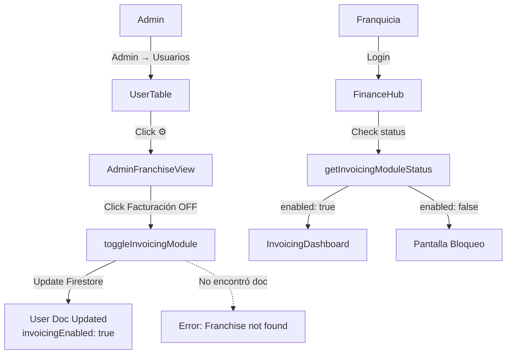

# Sistema de Activación del Módulo de Facturación

## 📋 Descripción General

Sistema que permite a los administradores activar o desactivar el módulo de facturación B2B para cada franquicia de forma independiente. Las franquicias solo pueden acceder al módulo de facturación si ha sido activado previamente por un administrador.

## 🔧 Arquitectura Técnica

### Backend (Firebase Functions)

#### Archivo: `functions/src/callables/invoicingModule.ts`

##### 1. toggleInvoicingModule
**Propósito:** Activar/desactivar el módulo de facturación para una franquicia
**Acceso:** Solo administradores
**Parámetros:**
- `franchiseId`: string - UID de la franquicia
- `enabled`: boolean - true para activar, false para desactivar

**Lógica de búsqueda (en orden de prioridad):**
1. Colección `franchises` con ID exacto
2. Colección `users` con ID exacto (si role === 'franchise')
3. Colección `users` con ID en minúsculas (compatibilidad)

**Campos actualizados:**
- `invoicingEnabled`: boolean - Estado del módulo
- `invoicingActivatedAt`: Timestamp | null - Fecha de activación
- `updatedAt`: Timestamp - Fecha de última actualización

##### 2. getInvoicingModuleStatus
**Propósito:** Consultar si el módulo está activado para una franquicia
**Acceso:** Administradores y la propia franquicia
**Parámetros:**
- `franchiseId`: string - UID de la franquicia

**Lógica de búsqueda:**
1. Colección `franchises` con ID exacto
2. Colección `users` con ID exacto
3. Colección `users` con ID en minúsculas (fallback)

**Respuesta:**
```typescript
{
  enabled: boolean,
  activatedAt: Date | null
}
```

### Frontend

#### Archivo: `src/hooks/useInvoicingModule.ts`

Hook personalizado para interactuar con las funciones de facturación:

```typescript
interface InvoicingModuleStatus {
    enabled: boolean;
    activatedAt: Date | null;
}

const {
    toggleModule,      // Activar/desactivar módulo
    getModuleStatus     // Consultar estado del módulo
} = useInvoicingModule();

// Ejemplo de uso:
await toggleModule('smHpadjQMXWX4WHVKZwt9VWWp822', true);
const status = await getModuleStatus('smHpadjQMXWX4WHVKZWT9VWWp822');
```

#### Archivo: `src/features/admin/AdminFranchiseView.tsx`

**Componente:** Vista de administración de franquicia

**Estado local:**
- `invoicingEnabled`: boolean - Estado actual del módulo
- `togglingInvoicing`: boolean - Loading state durante toggle

**Función handleToggleInvoicing:**
```typescript
const handleToggleInvoicing = async () => {
    const newState = !invoicingEnabled;
    await toggleModule(franchiseId, newState);
    setInvoicingEnabled(newState);
};
```

**UI: Botón de toggle**
- Ubicado en el header, al lado del botón "Entrar"
- Muestra "Facturación OFF" (gris) cuando está desactivado
- Muestra "Facturación ON" (verde) cuando está activado
- Icono de candado (Lock) encendido/apagado

#### Archivo: `src/features/finance/FinanceHub.tsx`

**Componente:** Hub de finanzas y facturación

**Lógica de verificación:**
```typescript
useEffect(() => {
    const checkInvoicingStatus = async () => {
        // Siempre usa user.uid (el ID de Firebase Auth)
        const franchiseId = user.uid;
        const status = await getModuleStatus(franchiseId);
        setInvoicingEnabled(status.enabled);
    };
    checkInvoicingStatus();
}, [user]);
```

**Estados de visualización:**

1. **Loading:** Spinner mientras verifica el estado
2. **Activado:** Muestra `InvoicingDashboard` completo
3. **Desactivado:** Muestra pantalla de bloqueo con:
   - Icono de candado grande
   - Título: "Módulo de Facturación No Activado"
   - Descripción: "Contacta con el administrador..."
   - Cards con funcionalidades premium
   - Botón de contacto

#### Archivo: `src/features/admin/users/UserTable.tsx`

**Modificación:** Botón de configuración para franquicias

**Ubicación:** Columna de acciones (extrema derecha)

**Icono:** Settings (engranaje) de color esmeralda

**Condición de visualización:**
```typescript
{user.role === 'franchise' && (
    <button onClick={() => onAction('viewFranchise', user)}>
        <Settings className="w-4 h-4" />
    </button>
)}
```

## 🚀 Flujo de Activación

### Desde la vista de Admin

1. **Navegación al panel de usuarios**
   - Menú lateral → Admin → Usuarios
   - URL: `/dashboard/admin/users`

2. **Buscar franquicia**
   - Usar el buscador o filtrar por rol "FRANQ"
   - Localizar la franquicia deseada (ej: Benavente)

3. **Acceder a configuración de franquicia**
   - Hacer clic en el botón ⚙️ (engranaje) en la fila de la franquicia
   - Navega a: `/admin/franchise/:franchiseId`

4. **Activar módulo de facturación**
   - En el header, hacer clic en "Facturación OFF"
   - El botón cambia a "Facturación ON" (verde)
   - Se actualiza el documento en Firestore
   - Se guarda la fecha de activación

### Desde la vista de Franquicia

1. **Acceso a Finanzas & Facturación**
   - Menú lateral → Finanzas & Facturación
   - URL: `/dashboard`

2. **Verificación de estado**
   - Al cargar, verifica si `invoicingEnabled === true`
   - Muestra contenido correspondiente según estado

3. **Si está activado:**
   - Dashboard completo con:
     - Tarjetas de estadísticas
     - Gráfico de tendencia de ingresos
     - Tabla de facturas recientes
     - Pestañas: Resumen, Facturas, Clientes
     - Botón "Nueva Factura"

4. **Si está desactivado:**
   - Pantalla de bloqueo
   - No muestra ninguna funcionalidad de facturación
   - Sugerencia de contactar al administrador

## 📁 Estructura de Datos en Firestore

### Colección `users`

Documento de usuario/ franquicia con módulo activado:

```typescript
{
  id: "smHpadjQMXWX4WHVKZWT9VWWp822",  // UID de Firebase Auth
  uid: "smHpadjQMXWX4WHVKZWT9VWWp822",
  email: "repaartbenavente@gmail.com",
  role: "franchise",
  
  // Campos del módulo de facturación
  invoicingEnabled: true,                    // ✅ Módulo activado
  invoicingActivatedAt: Timestamp(...),      // Fecha de activación
  updatedAt: Timestamp(...),                  // Última actualización
  
  // ... otros campos del usuario
}
```

## 🔐 Seguridad

### Validaciones en Backend

1. **toggleInvoicingModule:**
   - Usuario debe estar autenticado
   - Rol debe ser 'admin'
   - Validación de parámetros (franchiseId y enabled obligatorios)

2. **getInvoicingModuleStatus:**
   - Usuario debe estar autenticado
   - Solo admin o la propia franquicia (comparación case-insensitive)
   - Validación de parámetros (franchiseId obligatorio)

### IDs y Case Sensitivity

**Problema resuelto:**
- Firebase Auth UIDs son case-sensitive y pueden contener mayúsculas
- Ejemplo: `smHpadjQMXWX4WHVKZWT9VWWp822` (mixto, no todo minúsculas)

**Solución:**
1. Frontend siempre usa `user.uid` (ID real de Firebase Auth)
2. Backend busca primero con ID exacto, luego fallbacks
3. Comparaciones de autorización usan `.toLowerCase()`

## 📱 Componentes de UI

### 1. Botón de Configuración (Admin)
- **Ubicación:** `UserTable.tsx` (tabla de usuarios)
- **Apariencia:** Icono ⚙️ color esmeralda
- **Acción:** Navega a vista de detalles de franquicia

### 2. Botón Toggle (Admin)
- **Ubicación:** `AdminFranchiseView.tsx` header
- **Estados:**
  - OFF: Gris, icono candado apagado
  - ON: Verde, icono candado encendido
- **Texto:** "Facturación OFF" / "Facturación ON"

### 3. Pantalla de Bloqueo (Franquicia)
- **Ubicación:** `FinanceHub.tsx`
- **Elementos:**
  - Icono de candado grande
  - Título descriptivo
  - Explicación de funcionalidades
  - Call-to-action: contactar admin

## 🛠️ Mantenimiento y Troubleshooting

### Problemas Comunes

#### 1. "No se puede encontrar el documento"
**Causa:** IDs en mayúsculas vs minúsculas
**Solución:** Usar siempre `user.uid` en el frontend

#### 2. "Error 403 Unauthorized"
**Causa:** Permisos insuficientes
**Verificar:**
- Usuario autenticado
- Rol 'admin' para toggle
- UID coincide (case-insensitive)

#### 3. "El módulo no se activa visualmente"
**Causa:** Cache del navegador
**Solución:** Recargar página (Ctrl+Shift+R)

### Logs de Depuración

**Backend (Firebase Functions):**
```bash
firebase functions:log | grep toggleInvoicingModule
firebase functions:log | grep getInvoicingModuleStatus
```

**Frontend (Consola del navegador):**
- `[FinanceHub] Checking invoicing status for:`
- `[AdminFranchiseView] Toggling invoicing:`
- `[useInvoicingModule] Raw response:`
- `[useInvoicingModule] Parsed status:`

## 📦 Archivos Modificados

### Backend
- `functions/src/callables/invoicingModule.ts` (NUEVO)
- `functions/src/index.ts` (exportaciones)

### Frontend
- `src/hooks/useInvoicingModule.ts` (NUEVO)
- `src/features/admin/AdminFranchiseView.tsx` (MODIFICADO)
- `src/features/admin/users/UserTable.tsx` (MODIFICADO)
- `src/features/admin/users/UserManagementPanel.tsx` (MODIFICADO)
- `src/features/finance/FinanceHub.tsx` (MODIFICADO)
- `src/services/userService.ts` (MODIFICADO - mapeo de usuarios)

## 🔄 Flujo Completo



## 🎯 Casos de Uso

### Escenario 1: Activar módulo por primera vez
1. Admin entra a Users
2. Busca franquicia "Benavente"
3. Click en ⚙️
4. Click en "Facturación OFF"
5. ✅ Módulo activado
6. Franquicia ya puede acceder

### Escenario 2: Desactivar módulo (ej. impago)
1. Admin entra a configuración franquicia
2. Click en "Facturación ON"
3. ✅ Módulo desactivado
4. Franquicia ve pantalla de bloqueo

### Escenario 3: Franquicia intenta acceder sin activar
1. Franquicia entra a Finanzas & Facturación
2. Sistema verifica estado: `enabled: false`
3. Muestra pantalla de bloqueo
4. Recomienda contactar admin

## 🚀 Próximas Mejoras Potenciales

1. **Historial de activaciones:** Registrar quién y cuándo activó/desactivó
2. **Notificaciones:** Email al activar/desactivar
3. **Período de prueba:** Allow access por X días antes de pagar
4. **Estadísticas:** Uso del módulo por franquicia
5. **Bulk operations:** Activar múltiples franquicias a la vez
